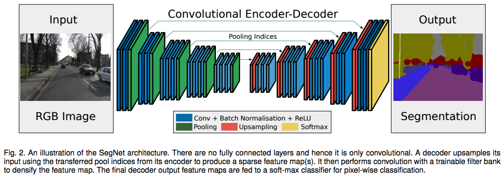
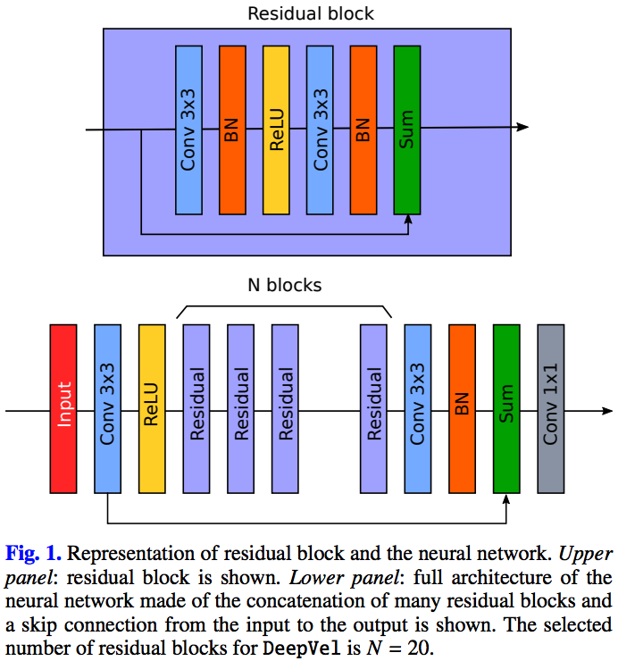

# Deep Learning with Keras

Implememnation of Deep Learning models in keras. 

## Convolutional neural networks

### SegNet

SegNet architecture ([Badrinarayanan et al. 2015](https://arxiv.org/abs/1511.00561)) for image segmentation.



### DeepVel

[DeepVel](https://github.com/aasensio/deepvel) architecture ([Asensio Ramos, Requerey & Vitas 2017](https://www.aanda.org/articles/aa/abs/2017/08/aa30783-17/aa30783-17.html)) for regression.



## Data

### Segmentation

**2D Semantic Labeling Contest**

The [semantic labeling contest](http://www2.isprs.org/commissions/comm3/wg4/semantic-labeling.html) of ISPRS provides two state-of-the-art airborne image datasets in [Vaihingen](http://www2.isprs.org/commissions/comm3/wg4/2d-sem-label-vaihingen.html) and [Potsdam](http://www2.isprs.org/commissions/comm3/wg4/2d-sem-label-potsdam.html), respectively for the detection of urban objects. 

Six categories/classes have been defined:

    1. Impervious surfaces (RGB: 255, 255, 255)
    2. Building (RGB: 0, 0, 255)
    3. Low vegetation (RGB: 0, 255, 255)
    4. Tree (RGB: 0, 255, 0)
    5. Car (RGB: 255, 255, 0)
    6. Clutter/background (RGB: 255, 0, 0)
    
**Sentinel-2 cropland mapping**

Following the paper by [Belgiu & Csillik (2018)] (see also [Hao et al. 2018](https://peerj.com/articles/5431/?utm_source=TrendMD&utm_campaign=PeerJ_TrendMD_0&utm_medium=TrendMD))(https://www.sciencedirect.com/science/article/pii/S0034425717304686) we are going to train SegNet for the segmentation of the croplands. As an input we can use [Sentinel-2 MSI](https://sentinel.esa.int/web/sentinel/missions/sentinel-2) multispectral data, and as an output crop types data classified by experts from the European Land Use and Coverage Area Frame Survey ([LUCAS](https://ec.europa.eu/eurostat/statistics-explained/index.php/LUCAS_-_Land_use_and_land_cover_survey)) and  CropScape – Cropland Data Layer ([CDL](https://nassgeodata.gmu.edu/CropScape/)), respectively.

Datasets in Google Earth Engine:

- [Sentinel-2 MSI: MultiSpectral Instrument, Level-1C](https://developers.google.com/earth-engine/datasets/catalog/COPERNICUS_S2)
- [USDA NASS Cropland Data Layers](https://developers.google.com/earth-engine/datasets/catalog/USDA_NASS_CDL)
- [Canada AAFC Annual Crop Inventory](https://developers.google.com/earth-engine/datasets/catalog/AAFC_ACI)

**Plantations by type and species**
- [Plantations by type](http://staging.globalforestwatch.org/v2/map?map=eyJkYXRhc2V0cyI6W3siZGF0YXNldCI6IjgzZjgzNjViLWY0MGItNGI5MS04N2Q2LTgyOTQyNTA5M2RhMSIsIm9wYWNpdHkiOjEsInZpc2liaWxpdHkiOnRydWUsImxheWVycyI6WyJhN2NjYjRmNS0wMDU3LTQwNzgtOTA3ZC1iY2Q4YzI4MGUwOGIiXX0seyJkYXRhc2V0IjoiZmRjOGRjMWItMjcyOC00YTc5LWIyM2YtYjA5NDg1MDUyYjhkIiwibGF5ZXJzIjpbIjZmNjc5OGU2LTM5ZWMtNDE2My05NzllLTE4MmE3NGNhNjVlZSIsImM1ZDFlMDEwLTM4M2EtNDcxMy05YWFhLTQ0ZjcyOGMwNTcxYyJdLCJvcGFjaXR5IjoxLCJ2aXNpYmlsaXR5Ijp0cnVlfV0sImNhbkJvdW5kIjpmYWxzZSwiem9vbSI6NywiY2VudGVyIjp7ImxhdCI6LTAuMTczNjM1MjE3MDEwNzU4NywibG5nIjoxMDAuOTc4NTYwNDQ3NjkyODl9LCJiYm94IjpudWxsLCJiYXNlbWFwIjp7ImlkIjoiZGVmYXVsdCIsInZhbHVlIjoiZGVmYXVsdCIsImxhYmVsIjoiZGVmYXVsdCIsImNvbG9yIjoiI0EyREZGRiIsInVybCI6Imh0dHBzOi8vYXBpLm1hcGJveC5jb20vc3R5bGVzL3YxL3Jlc291cmNld2F0Y2gvY2psaHdhb2gyMTFocDJzdGVtZnowaW1xZi90aWxlcy8yNTYve3p9L3t4fS97eX1AMng%2FYWNjZXNzX3Rva2VuPXBrLmV5SjFJam9pY21WemIzVnlZMlYzWVhSamFDSXNJbUVpT2lKamFqRmxjWFpoTnpjd01EQnFNek56TVRRMGJETjZZM1U0SW4wLkZSY0lQX3l1c1ZhQXkwbXdBWDFCOHcifX0%3D&menu=eyJzZWxlY3RlZFNlY3Rpb24iOiJsYW5kQ292ZXIifQ%3D%3D&recentImagery=eyJ2aXNpYmxlIjpmYWxzZX0%3D)
- [Plantations by species](http://staging.globalforestwatch.org/v2/map?map=eyJkYXRhc2V0cyI6W3siZGF0YXNldCI6IjgzZjgzNjViLWY0MGItNGI5MS04N2Q2LTgyOTQyNTA5M2RhMSIsIm9wYWNpdHkiOjEsInZpc2liaWxpdHkiOnRydWUsImxheWVycyI6WyJlMGY3ZDczMS1mODBhLTQ5ZWMtODQwZi1iY2Q0MGYwOTI5MzMiXX0seyJkYXRhc2V0IjoiZmRjOGRjMWItMjcyOC00YTc5LWIyM2YtYjA5NDg1MDUyYjhkIiwibGF5ZXJzIjpbIjZmNjc5OGU2LTM5ZWMtNDE2My05NzllLTE4MmE3NGNhNjVlZSIsImM1ZDFlMDEwLTM4M2EtNDcxMy05YWFhLTQ0ZjcyOGMwNTcxYyJdLCJvcGFjaXR5IjoxLCJ2aXNpYmlsaXR5Ijp0cnVlfV0sImNhbkJvdW5kIjpmYWxzZSwiem9vbSI6NywiY2VudGVyIjp7ImxhdCI6LTAuMTczNjM1MjE3MDEwNzU4NywibG5nIjoxMDAuOTc4NTYwNDQ3NjkyODl9LCJiYm94IjpudWxsLCJiYXNlbWFwIjp7ImlkIjoiZGVmYXVsdCIsInZhbHVlIjoiZGVmYXVsdCIsImxhYmVsIjoiZGVmYXVsdCIsImNvbG9yIjoiI0EyREZGRiIsInVybCI6Imh0dHBzOi8vYXBpLm1hcGJveC5jb20vc3R5bGVzL3YxL3Jlc291cmNld2F0Y2gvY2psaHdhb2gyMTFocDJzdGVtZnowaW1xZi90aWxlcy8yNTYve3p9L3t4fS97eX1AMng%2FYWNjZXNzX3Rva2VuPXBrLmV5SjFJam9pY21WemIzVnlZMlYzWVhSamFDSXNJbUVpT2lKamFqRmxjWFpoTnpjd01EQnFNek56TVRRMGJETjZZM1U0SW4wLkZSY0lQX3l1c1ZhQXkwbXdBWDFCOHcifX0%3D&menu=eyJzZWxlY3RlZFNlY3Rpb24iOiJsYW5kQ292ZXIifQ%3D%3D&recentImagery=eyJ2aXNpYmxlIjpmYWxzZX0%3D)
- [dataset](https://api.resourcewatch.org/v1/dataset/83f8365b-f40b-4b91-87d6-829425093da1?includes=layer)

**Global Annual Burned Area Mapping**
[](https://arxiv.org/abs/1805.02579)
## Requirements

### Prerequisites

* Keras 2.2.2
* TensorFlow 1.10.0

```shell
pip install --upgrade keras
pip install --upgrade tensorflow
pip install --upgrade tensorflow-gpu
```